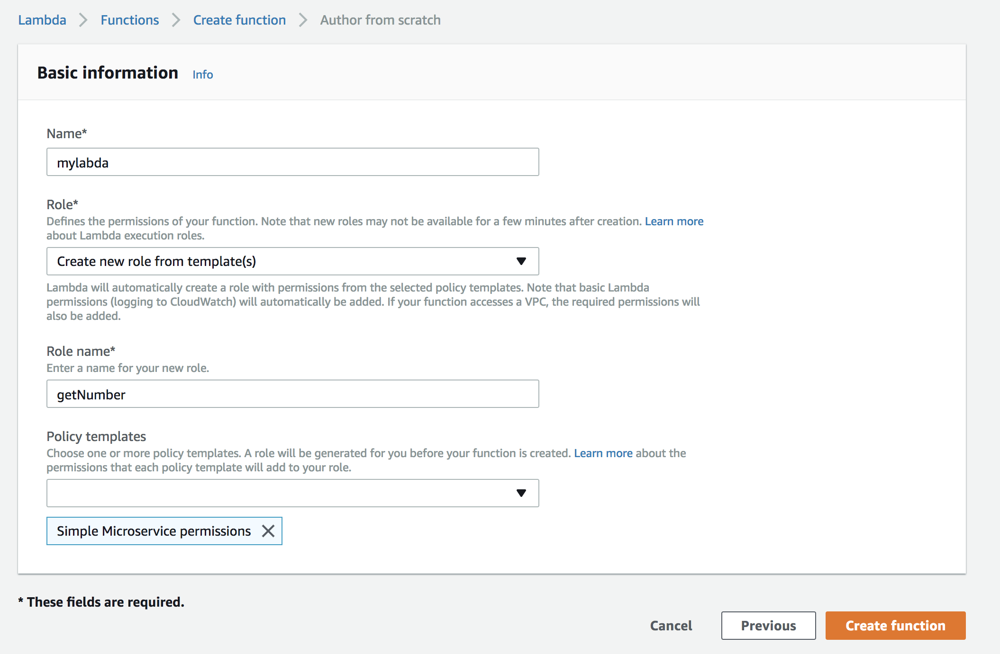
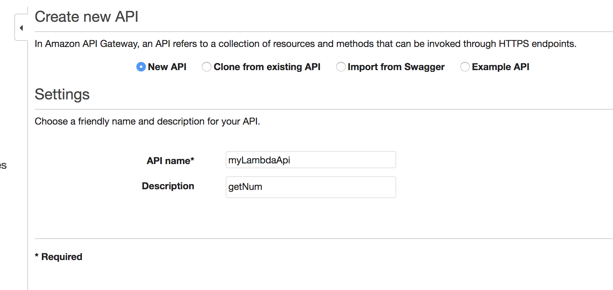
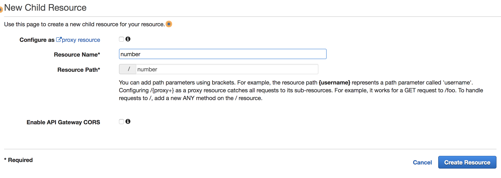
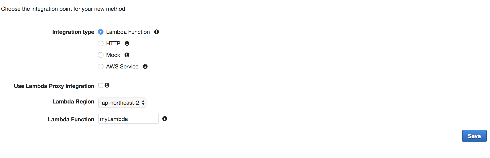
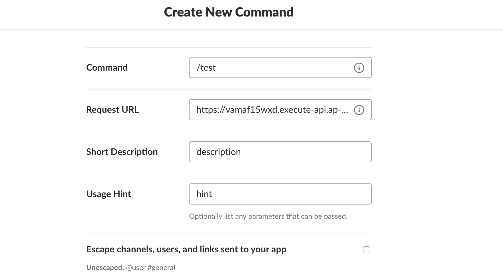

## AWS Lambda

Aws Lambda 탭에 들어가서 함수 생성, 새로 작성


템플릿에서 새 역할 작성


권한 통제를 설정할 수 있다.

IAM에서 새 권한 생성하거나, 단순 마이크로 권한 부여


## Lambda 함수를 이용해 Slack Bot command 만들기

Aws Lambda의 리턴 값을 이용해 Slack Bot의 Slash Command를 만들어 보자.

### Lambda 함수 생성하기

Aws Console에서 > Functions -> Create Function으로 람다 함수를 생성한다.



위의 설정을 채우고 Create Function을 한 후에 Function Code를 작성한다.

```javascript
exports.handler = (event, context, callback) => {
    context.succeed({
        "response_type": "in_channel",
        "text": "It's 80 degrees right now.",
        "attachments": [
            {
                "text": "fuck"
            }
        ]
    });
};
```

Java Code는 웹에서 코드로 작성할 수 없고, Eclipse의 Aws Toolkit의 New Lambda Java Project를 이용하면 바로 Lambda Function을 생성할 수 있다.

위 코드에서 슬랙에서 넘어오는 값인 text 를 받아서 메시지를 구성하였다. `context.succeed()` 함수는 AWS Lambda에서 사용하는 반환 함수이며, 이 함수의 인자로 슬랙의 메시지를 담아 반환하면 된다. 이 때 반환값은 JSON 형식으로 작성하면 되고, [슬랙의 메시지 형식](https://api.slack.com/docs/formatting)에 맞추면 된다. 코드를 작성하고 오른쪽 위에 Save and Test를 클릭하자.


###  Lambda Api GateWay 생성하기

Lambda 함수는 기본적으로 이벤트에 반응한다. 여기서 말하는 이벤트는 아마존 웹서비스에서 발생하는 어떤 것이다(예를 들면 S3에 어떤 파일을 추가하는 것과 같은 이벤트). 그렇지만 우리에게 필요한 것은 웹 URL이다. AWS Lambda를 웹 호출을 통해 실행시키려면 또다른 아마존 웹서비스 중 하나인 [Amazon API Gateway](https://aws.amazon.com/ko/api-gateway/)를 연결해야 한다.



생성 후에 Action -> Create Resource



생성 후에 Action -> Create Method를 통해 Post나 Get 메소드를 생성하자.

Slack은 Post로 구현해야 하므로 Post 메소드를 생성하자.



여기까지 하면 API와 람다 함수 간의 연결 작업은 완료되지만, 한 가지 남은 일이 있다. Slack이 API를 통해 보낸 값을 람다 함수가 제대로 받아서 처리하게 하려면 약간의 데이터 변환이 필요하다. Slack은 API를 호출할 때 HTML Form 형식으로 데이터를 전달하지만 API Gateway를 통해 람다함수로 전해지는 데이터는 기본적으로 JSON 형식이기 때문에 Slack으로부터 받은 POST 데이터를 Lambda 함수가 처리할 수 있도록 변환하는 작업을 해 줘야 한다. 

생성 후 4개의 메뉴 중 **Integration Request**를 클릭해서 Body Mapping Templates 에 Mapping Template을 추가해 주면 된다. 이 때 Content-Type을 ```application/x-www-form-urlencoded```로 설정하자, 이는 Slack의 슬래시 커맨드가 이 컨텐트 타입을 사용하기 때문이다.

추가 한 다음에 밑의 빈 영역에 [[폼 방식의 POST 데이터를 JSON으로 변환시키는데 필요한 맵핑 루틴](https://gist.github.com/sjoonk/20ae13e5cd8be88e9824e3bad11b2859)]을 넣어서 추가해주자.

작업을 모두 완료 한 후에 Action -> Deploy API를 클릭해 Lambda Function을 Deploy 해 주자


## Create Slack App

**Slack Api 사이트 -> Create New App**

**Add features and functionality -> Slash Commands -> Create New Command**




앱 생성 후 Setting Install App 한 후 슬랙에서 테스트 해보면 잘 출력된다.