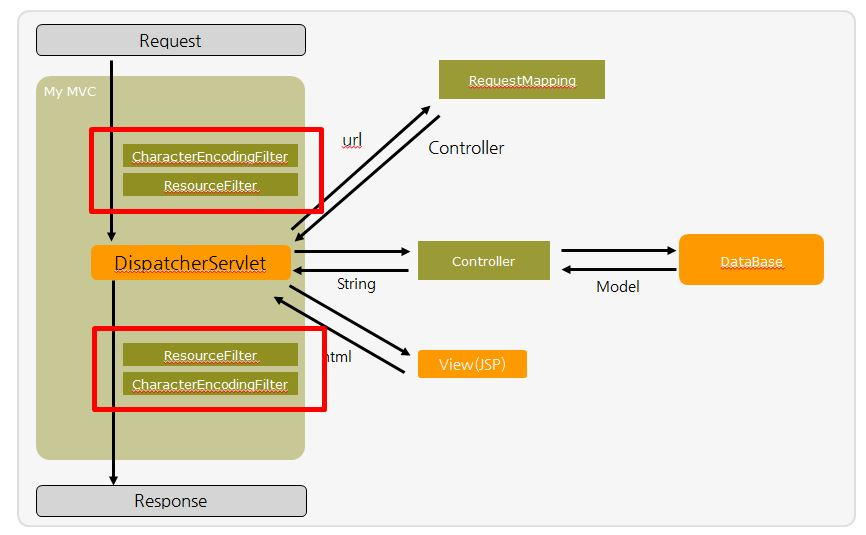

## 오늘 한일

- ### Servlet과 ServletFilter

오늘은 [ServletFilter 실습](https://xmfpes.github.io/java/servlet-filter/)을 진행했습니다.

Servlet 요청에 대해 filter를 설정할수 있는 ServletFilter에 대해 공부했습니다.

Servlet 전체적으로 적용되어야 하는 중복되는 부분에 대해 ServletFilter를 처리해서 중복을 줄일 수 있을것 같습니다.

Spring Security에서 로그인 유무나 세션 관리를 위해 Filter를 사용하기도 하고 Spring 내부적으로 ServletFilter를 통해 구현된 내용이 있는것 같으니 어느정도 알고 넘어가야 할 것 같습니다.

오늘 학습에서 궁금했던 점들

- 위의 그림에서 모든 요청을 DispatcherServlet에서 처리하는데, 이전에 배웠던 내용인 ServletContainer에서 처리해 주는 부분과 겹치는데 Tomcat(ServletContainer) 내부에서 DispatcherServlet의 기능이 돌아가는건지 명확하게 정리되지 않음
- 관련 내용을 찾아보니 Spring의 구조에서도 DispatcherServlet이 등장하는데 위의 그림이 Spring을 기준으로 든건지, Servlet과 Spring 모두 내부적으로 위처럼 동작하는 지에 대해 개념이 잡히지 않음

- ### Aws Lambda와 Slack Bot 만들기

오늘 계속 해보고 싶었던 Aws Lambda를 구현해봤습니다.

[Lambda를 이용한 Slack Bot 만들기](https://xmfpes.github.io/aws/lambda/)사용해 보고 싶어서 Aws Console을 키는 순간 옆에서 브라이언이 말 나온 김에, 간단하게 강의를 하자고 해서 벡엔드 전체가 같이 프로젝터를 이용해 학습했습니다.

간단한 내용을 진행하고, 리턴 값만 주면 되는 간단한 구조네 하면서 Slack Bot Api를 제작하는데 Doc을 제대로 읽지 않아서 한참 고생했습니다. 영어가 부족하다 보니 Api 활용에 있어 사소한 부분을 자주 놓치는 것 같습니다.

HTTP POST with a `Content-type` header set as `application/x-www-form-urlencoded`. 이 부분을 JSON으로 받는 부분을 빼먹고 구현했습니다. Slack bot의 slash command는 `Content-type`헤더가`application/x-www-form-urlencoded`으로 셋팅 되는데, 아직 Amazon API Gateway에서는 폼 방식의 데이터를 JSON 형식으로 변환하는 부분을 제공하지 않기 때문에 에러가 발생했었습니다.

이 내용을 제대로 보지 않고 한참 고생했습니다. 같은 레벨 4의 브라이언이나 CU는 여러 문서들을 잘 보고 활용하는것 같은데, 아직 활용한 경험이 부족해서인지 그런 부분이 많이 부족한 것 같습니다.

api를 잘 활용할 수 있도록 문서들을 잘 보고 잘 활용할 수 있는 능력을 길러야겠습니다.

- - -
## 내일 할 일

- ### 치과가기

병원 갈 시간이 없다.. 

- ### MVC 프레임워크 구현 셋팅하기

진행은 주말에 하고, 셋팅을 먼저 진행해보자

- ### 우아한형제들 코딩 테스트 플랫폼 구름 테스트 문제 풀어보기

플랫폼에 익숙해지기 위해 예시 문제를 풀어보자

###  

------

## 나중에 차차 해볼것들

- ### Aws Rds / Dynamo DB 사용해보기

AWS의 Cloud 기반 DB를 사용해보자.

- ### 코딩 테스트 대비 문제를 플랫폼을 정해 풀어보자

오늘 다른 과정의 사람들과 밥 먹으면서 이야기를 했는데, 코딩 테스트를 200문제 넘게 풀었다고 한다. 여러 문제들을 푸는것도 좋지만 기록 할 수 있도록 백준 저지 사이트나 다른 플랫폼을 이용해 풀어보자.

------

나름 노력하고는 있지만, 학습 효율이 많이 떨어지는 것 같다. 과정의 전체적인 흐름이나 앞으로 개발자로서 어떻게 해야할지에 대한 생각을 계속 하고 있는데 조금 정리를 해보고 다음주에 면담을 진행해봐야 할 것 같다.

